# 初入IJ:

#### soutp=System.out.println("方法形参名 = " + 形参名); 

#### soutv=System.out.println("变量名 = " + 变量); 

#### soutm=System.out.println("当前类名.当前方法"); 

#### “abc”.sout  => System.out.println("abc"); 

#### fori : 可生成 for 循环 

#### iter：可生成增强 for 循环 itar：可生成普通 for 循环 

####  list.for : 可生成集合 list 的 for 循环 

#### List String  list = new ArrayList String(); 

#### 输入: list.for 即可输出 for(String s:list){ } 

#### 又如：list.fori  或 list.forr 

####  prsf：可生成 private static final  

####  类似的：  

#### psf：可生成 public static final  

#### psfi：可生成 public static final int  

#### psfs：可生成 public static final String 

---

## java线程：程序、进程、线程：

+ ### 程序（program）是为完成特定任务、用某种语言编写的一组指令的集合。即指一段静态的代码，静态对象。

+ ### 进程（process）是程序的一次执行过程，或是正在运行的一个程序。是一个动态的过程：有它自身的产生、存在和消亡的过程。——生命周期

  + ##### 如：运行中的QQ，运行中的MP3播放器

  + ##### 程序是静态的，进程是动态的

  + ##### 进程作为资源分配的单位，系统在运行时会为每个进程分配不同的内存区域

+ ### 线程（thread），进程可进一步细化为线程，是一个程序内部的一条执行路径。

  + ##### 若一个进程同一时间并行执行多个线程，就是支持多线程的

  + ##### 线程作为调度和执行的单位，每个线程拥有独立的运行栈和程序计数器（pc），线程切换的开销小

  + ##### 一个进程中的多个线程共享相同的内存单元/内存地址空间〉它们从同一堆中分配对象，可以访问相同的变量和对象。这就使得线程间通信更简便、高效。但多个线程操作共享的系统资源可能就会带来安全的隐患。

## 内存结构：

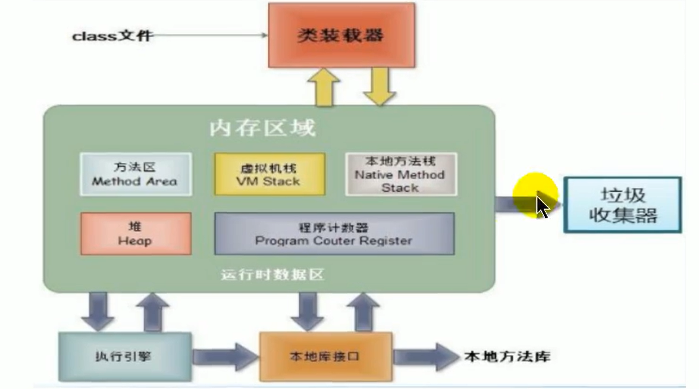

 	

+ #### 每一个线程，存在一套虚拟机栈和程序计数器；

+ #### 而每个进程，拥有一套方法区和堆；而多个线程共享一个进程中的这两个区；

+ #### 一个Java应用程序java.exe，其实至少有三个线程：main（）主线程，gc（）垃圾回收线程，异常处理线程。当然如果发生异常，会影响主线程。

  ##### 并行：多个CPU同时执行多个任务。比如：多个人同时做不同的事。

  ##### 并发：一个CPU（采用时间片）同时执行多个任务。比如：秒杀、多个人做同一件事。

### 并行与并发：

+ ##### 并行：多个CPU同时执行多个任务。比如：多个人同时做不同的事。

+ ##### 并发：一个CPU（采用时间片）同时执行多个任务。比如：秒杀、多个人做同一件事。

## 为何使用线程：

> #### 以单核CPU为例，只使用单个线程先后完成多个任务（调用多个方法），肯定比用多个线程来完成用的时间更短，即一心一意 要比 一心多意 快；而若是多核，就可以考虑每个核去做不同的事，提高效率。

### 多线程程序的优点：

##### 1.提高应用程序的响应。对图形化界面更有意义，可增强用户体验。

##### 2.提高计算机系统CPU的利用率

##### 3.改善程序结构。将既长又复杂的进程分为多个线程，独立运行，利于理解和修改

### 使用场景：

##### 1·程序需要同时执行两个或多个任务。

##### 2·程序需要实现一些需要等待的任务时，如用户输入、文件读写操作、网络操作、搜索等。

##### 3·需要一些后台运行的程序时。

~~~java
//线程：
package Senior.RRW.Thread;
/**
 *@description: 线程创建步骤：
 *          1.创建一个继承于Thread类的子类；
 *          2.重写thread类的run()
 *          3.创建thread类的子类对象；
 *          4.通过此对象调用start()
 *@author: RRW friend_rrw@163.com
 *@create: 2020-06-05 17:24
 */
public class ThreadTEST {
    public static void main(String[] args) {
        MThread m1 = new MThread();//主线程造了一个对象
        //首先是启动线程，然后调子类重写父类的run(),
        // 且start()只能被同一对象调用一次；
        m1.start(); //由mThread对象去执行run方法，这是支线程

        //再启动一个线程：
        MThread m2 = new MThread();
        m2.start();

        //以下还是main 主线程执行的操作：
        for (int i = 0; i < 50; i++) {
            System.out.println(Thread.currentThread().getName()+
                    ":" + "我是主线程");
        }
        System.out.println(Thread.currentThread().getName()+"OMG");//主线程继续执行着，输出这条语句；
    }
}

class MThread extends Thread{
    @Override
    public void run(){
        //线程操作：
        for (int i = 0; i < 50; i++) {
            if (i % 2 == 0){
                System.out.println(Thread.currentThread().getName()+"-"+i + " ");
            }
        }
    }

}
//在输出结果中是可以看到主线程执行的是什么内容，支线程执行的是什么内容，且每次执行结果不一样；

//用Thread类的匿名子类方式创建线程：
package Senior.RRW.Thread;
/**
 * @author RRW friend_rrw@163.com
 * @create 2020-06-05-21:01
 */

/**
 * @description: 创建两个线程：
 * 1.一个线程遍历50以内的奇数；
 * 2.一个线程遍历50以内的偶数；
 * @author: RRW friend_rrw@163.com
 * @create: 2020-06-05 21:01
 */
public class ThreadTEST02 {
    public static void main(String[] args) {
//        //方式一：你造你的做你的，我造我的做我的；
////        myThread1 m1 = new myThread1();
////        myThread2 m2 = new myThread2();
////        m1.start();
////        m2.start();
        //方式二：用Thread类的匿名子类
        new Thread() {   
            @Override
            public void run() {   //合并后的形式：（Thread） run() -> { }.start();
                for (int i = 0; i < 50; i++) {
                    if (i % 2 == 0) {
                        System.out.println(Thread.currentThread().getName() + ":" + i);
                    }
                }
            }
        }.start();
        new Thread() {
            @Override
            public void run() {
                for (int i = 0; i < 50; i++) {
                    if (i % 2 != 0) {
                        System.out.println(Thread.currentThread().getName() + ":" + i);
                    }
                }
            }
        }.start();
    }
}

class myThread1 extends Thread {
    @Override
    public void run() {
//        for (int i = 0; i < 50; i++) {
//            if (i % 2 == 0) {
//                System.out.println(Thread.currentThread().getName()+":"+i);
//            }
//        }
    }
}

class myThread2 extends Thread {
    @Override
    public void run() {
//        for (int i = 0; i < 50; i++) {
//            if (i % 2 != 0) {
//                System.out.println(Thread.currentThread().getName()+":"+i);
//            }
//        }
    }
}
~~~

### 线程中常用方法 与 调度：

+ #### 常用方法

~~~java
package Senior.RRW.Thread;
/**
 * @author RRW friend_rrw@163.com
 * @create 2020-06-05-21:23
 */

/**
 * @description: Thread中常用的方法：
 * 1.start()：启动当前线程；调用run();
 * 2.run():是重写Thread类中的方法；里面放要执行的代码；
 * 3.currentThread():是一个静态方法，返回执行当前代码的线程；
 * * getName():获取当前线程的名字；
 * * setName():创建当前线程的名字；
 * 4.yield():释放执行权；
 * 5.join():A线程调用的B线程的join()方法，使A阻塞
 * B线程先执行完毕，A线程阻塞状态技术，才继续执行；
 * 6.stop():强制结束当前线程，已经out了，不推荐使用；
 * 7.sleep():使当前线程进入sleep(一段时间的阻塞状态)
 * 8.isAlive():判断当前线程是否存活；
 *
 * 线程的：
 * 1.MAX_PRIORITY:10;
 * 2.MIN_PRIORITY:1;
 * 3.NORM_PRIORITY:5;  默认优先级
 * 获取方法：
 *      1.getPriority():获取线程的优先级；
 *      2.setPriority(int p):设置线程的优先级；
 *    注意：并不是说优先级高的会先执行，
 *          有点vip的意思，也有点概率高的意思；也会有穿插执行的情况
 * @author: RRW friend_rrw@163.com
 * @create: 2020-06-05 21:23
 */
class test01Thread extends Thread {
    @Override
    public void run() {
        for (int i = 0; i < 50; i++) {
            System.out.println(Thread.currentThread().getName() +
                    ":"+"优先级为：" +getPriority()+ " " + i);
            if (i == 30) {
//            yield();
//                try {
//                    //当i=30时，阻塞5s，并且等待任务分配
//                    sleep(5000);
//                } catch (InterruptedException e) {
//                    e.printStackTrace();
//                }
//            }
        }
        }
    }

    public test01Thread(String name) {
        super(name);

    }
}

public class test01_Thread {
    public static void main(String[] args) {
        test01Thread t1 = new test01Thread("thread:新名字");
//        t1.setName("线程1:");
        t1.setPriority(Thread.MAX_PRIORITY);//设子线程优先级最高；
        t1.start();
        Thread.currentThread().setName("给主线程命的名:");
        Thread.currentThread().setPriority(Thread.MIN_PRIORITY);//设主线程的优先级为最低；
        for (int i = 0; i < 50; i++) {
            System.out.println(Thread.currentThread().getName() + ":" + i);
//            if (i % 20 == 0) {
//                try {
//                    t1.join();//子线程执行完，主线才继续执行；
//                } catch (InterruptedException e) {
//                    e.printStackTrace();
//                }
//            }
        }
    }
}
~~~

+ ### 调度：

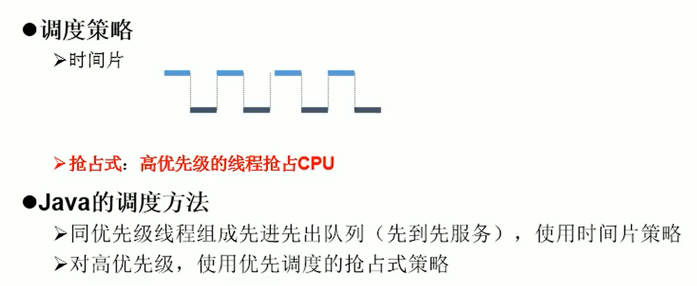

## 两种创建Thread方式的对比：

+ ### 继承方式：class Stalls extends Thread ;

+ ### 实现Runnable接口的方式：public class ThreadTESTnew03 ;

  #### 	1.接口方式实现时没有单继承的局限性；

  #### 	2.实现的方式更适合处理多个线程共享数据的情况； 

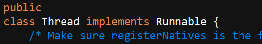

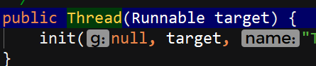

#### 			3.可以看出 第一种方式是我造了一个Thread类的子类 ，然后Thread 类实现了Runnable，所以这个子类也可以实现Runnable ； 而第二种接口的方式则可以通过接口的“多继承”直接实现了Runnable；

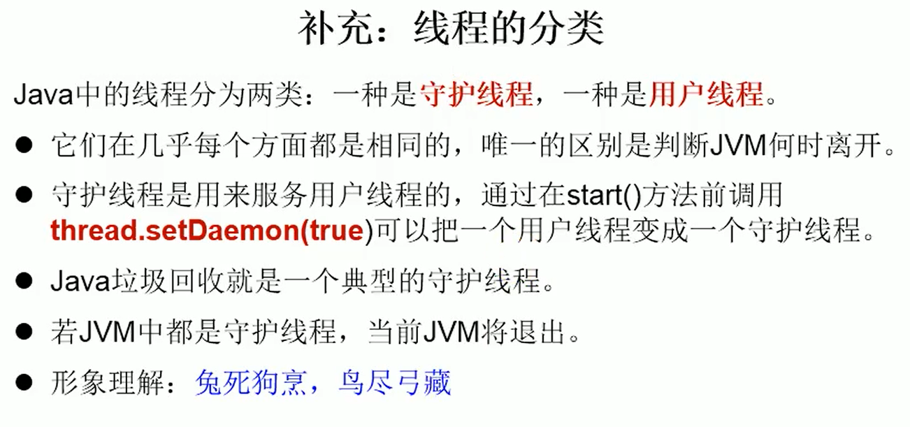

---

## 线程的生命周期：

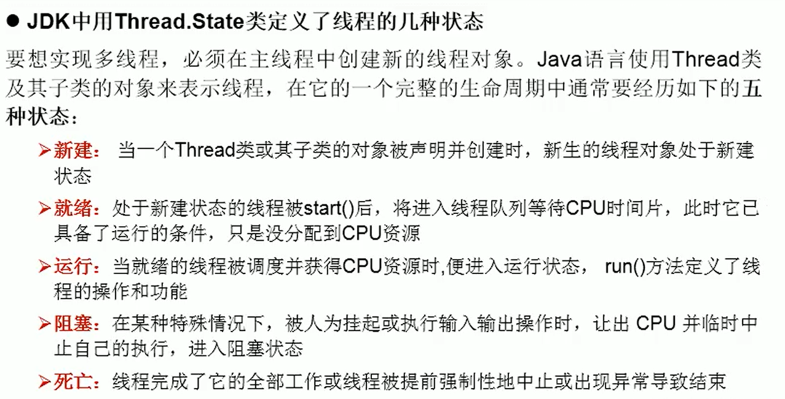

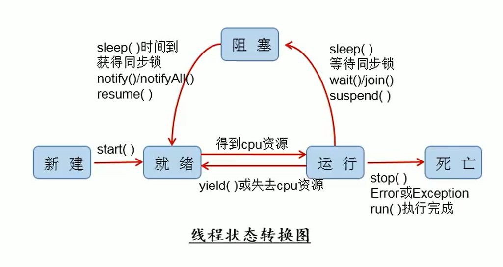

### synchronized 解决线程的安全问题：

~~~java
//ThreadTEST03.java:
package Senior.RRW.Thread;
/**
 * @description:
 *     线程创建方式二：
 *         eg：搞三个地毯摆摊赚钱，卖100串肉串；
 * @author: RRW friend_rrw@163.com
 * @create: 2020-06-05 23:13
 */

class Stalls extends Thread { //继承方式；
    private static int Kebabs = 500;//500串肉串；
    // 可能会出现重，因为存在线程安全问题，待解决
//    private static Object obj = new Object();
    @Override
    public void run() {
             while (true) {
                synchronized (SafetyThread.class) { //或放obj
                try {
                    Thread.sleep(100);
                } catch (InterruptedException e) {
                    e.printStackTrace();
                }
                if (Kebabs > 0) { //串串还有
                    System.out.println(getName() + "：卖出去第"
                            + Kebabs + "串");
                    Kebabs--;
                } else {
                    break;
                }
            }
        }
    }
}
public class ThreadTEST03 {
    public static void main(String[] args) {
        Stalls s1 = new Stalls();
        Stalls s2 = new Stalls();
        Stalls s3 = new Stalls();

        s1.setName("摊位1:");
        s2.setName("摊位2:");
        s3.setName("摊位3:");
        s1.start();
        s2.start();
        s3.start();
    }

}

//SafetyThread.java：
package Senior.RRW.Thread;
/**
 *@description:  NEWStalls.java的进阶 ：线程安全
 *                 即 有可能会出现重复（卖出同一串）,或出现-1、0的情况
 *                 如购票 取钱等问题，不能重票错票问题 两个人“同时取一笔钱”这样的情况；
 *           解决：“同步机制”：
 *                  方式一：同步代码块：
 *                         synchronized(同步监视器){
 *                          //需要被同步的代码(操作共享数据(有多个线程操作)的代码)
 *                         //同步监视器：“锁”；即 任何一个类的对象都可以充当“锁”；
 *                         //且多个线程必须同用一把“锁”；相当于“单线程”在操作，效率变低但安全；
 *
 *                         //若是在“继承”的情况下，有可能是new了几个对象，
 *                         //此时，创建共用对象obj时，就得是static的了，使得
 *                         //这几个对象共用一把锁；见：ThreadTEST03.java
 *                         }
 *                         //更简便的写法：使用this，不用再新建共用对象，此时的this，
 *                         //为当前类的对象，则ThreadTEST03中当前类中有三个类的对象，
 *                         //不能用this，可以用类 xxx.class来“充当对象”；此处往后拓展；
 *
 *                  方式二：同步方法：
 *                         //如果操作共享数据的代码完整的声明在一个方法中，
 *                         //那就可以把此方法声明为同步的； private synchronized void FF() {}
 *                         //如果是继承方式实现的呢？ 同样离不开static ，同接口方式操作：
 *                         //写成：private static synchronized void FF() {}
 *                         //总结： 非静态的同步方法，同步监视器是this；
 *                                  静态的同步方法，同步监视器是当前类本身；
 *
 *@author: RRW friend_rrw@163.com
 *@create: 2020-06-06 21:12
 */

class NEWStallsforsafety implements Runnable {
    private int Kebabs = 500;
    Object obj = new Object();//保证对象的唯一性；

    @Override
    public void run() {

        while (true) {
//            synchronized (obj) {
//            if (Kebabs > 0) { //串串还有
//                try {  //sleep()放这出现-1的概率大一些
//                    Thread.sleep(100);
//                } catch (InterruptedException e) {
//                    e.printStackTrace();
//                }
//                System.out.println(Thread.currentThread().getName()
//                        + "：卖出去第" + Kebabs + "串");
//                //sleep()放这出现重 串概率高一些
//                Kebabs--;
//            } else {
//                break;
//            }
//        }
            FF();
        }
    }
    private synchronized void FF() { //同步方法的方式解决
        if (Kebabs > 0) { //串串还有
            try {  //sleep()放这出现-1的概率大一些
                Thread.sleep(100);
            } catch (InterruptedException e) {
                e.printStackTrace();
            }
            System.out.println(Thread.currentThread().getName()
                    + "：卖出去第" + Kebabs + "串");
            //sleep()放这出现重 串概率高一些
            Kebabs--;
        }
        }
    }

public class SafetyThread {//实现Runnable接口的方式
    public static void main(String[] args) {
        NEWStallsforsafety s1 = new NEWStallsforsafety();
        Thread t1 = new Thread(s1); //s1是t1/t2/t3共享的
        Thread t2 = new Thread(s1);
        Thread t3 = new Thread(s1);
        t1.setName("摊位1:");
        t2.setName("摊位2:");
        t3.setName("摊位3:");
        t1.start();
        t2.start();
        t3.start();
    }
}
~~~

### 使用同步机制解决 懒汉式 的线程安全问题：

~~~java
package Senior.RRW.Thread;

/**
 *@description:  使用同步机制解决 懒汉式 的线程安全问题;
 *@author: RRW friend_rrw@163.com
 *@create: 2020-06-06 23:34
 */
public class Lazy_singleton {

}
class Bank_Lasy {
    private Bank_Lasy() {
    }

    private static Bank_Lasy instance = null;

    public static Bank_Lasy getInstance() {//直接加synchronized简单解决线程安全的问题；
        //方式一：效果比较差；因为等第一个线程进去执行完之后，资源用完了，但后面的线程还进去，还要一个个告诉它，没东西了，有点浪费的意思；
//        synchronized (Bank_Lasy.class) { //等同于上面直接加synchronized
//            if (instance == null){ //instance就是共享的了
//                instance = new Bank_Lasy();
//            }
//            return instance;
//        }

        //方式二：效率较高；
        if (instance == null) { //多加一个判断，相当于前几个进去的线程进去出来之后，
                                //在入口就告诉后面的线程，里面已经空了；
            synchronized (Bank_Lasy.class) {
                if (instance == null) {
                    instance = new Bank_Lasy();
                }
            }
        }
        return instance;
    }
}
~~~

## 线程的死锁：

> ### 不同的线程分别占用对方需要的同步资源不放弃，都在等待对方放弃自己需要的同步资源，就形成了线程的死锁;
>
> #### 出现死锁后，不会出现异常，不会出现提示，只是所有的线程都处于阻塞状态，无法继续。详细见   ==Deadlock.java 、Dead_Lock==
>
> #### 解决方法
>
> ##### 		专门的算法、原则;
>
> ##### 		尽量减少同步资源的定义;
>
> ##### 		尽量避免嵌套同步;

## lock锁：

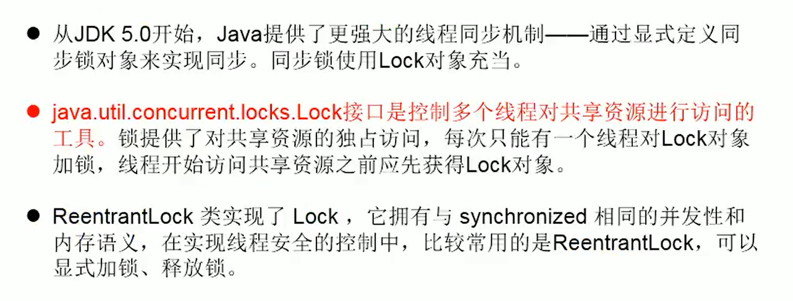

~~~java
package Senior.RRW.Thread;

import java.util.concurrent.locks.ReentrantLock;

/**
 * @description: 解决线程安全方式三: LOCK锁
 *                  synchronized 与 lock：
 *                      区别： synchronized是在执行完同步代码后悔自动释放同步监视器；
 *                            lock则需要手动 lock.lock();-----lock.unlock();
 * @author: RRW friend_rrw@163.com
 * @create: 2020-06-07 00:38
 */

class stalls implements Runnable {
    //1.实例化 ReentrantLock
    private ReentrantLock lock = new ReentrantLock(true);
    // ctrl + alt + / 参数提示快捷键
    //"fair:true" ： 是否公平，不写就是不公平的；先进先出，先来先得
    //LOCK本身是一个接口，具体使用的是它的子类ReentrantLock；

    private int Kebabs = 100; //继续卖羊肉串

    @Override
    public void run() {
        while (true) {
            try {
                // 2.调用lock方法： //也是类似写成像前面的“单线程”
                lock.lock();
                if (Kebabs > 0) { //串串还有

                    try {
                        Thread.sleep(100);
                    } catch (InterruptedException e) {
                        e.printStackTrace();
                    }

                    System.out.println(Thread.currentThread().getName() + "：卖出去第"
                            + Kebabs + "串");
                    Kebabs--;
                } else {
                    break;
                }
            } finally {
                //3. 调用解锁方法：
                lock.unlock();
            }
        }
    }
}

public class LOCK_Thread {
    public static void main(String[] args) {
        stalls s1 = new stalls();
        Thread thread1 = new Thread(s1);
        Thread thread2 = new Thread(s1);
        Thread thread3 = new Thread(s1);

        thread1.setName("摊位1：");
        thread2.setName("摊位2：");
        thread3.setName("摊位3：");
        thread1.start();
        thread2.start();
        thread3.start();
    }
}
~~~

##  synchronized 与 lock：

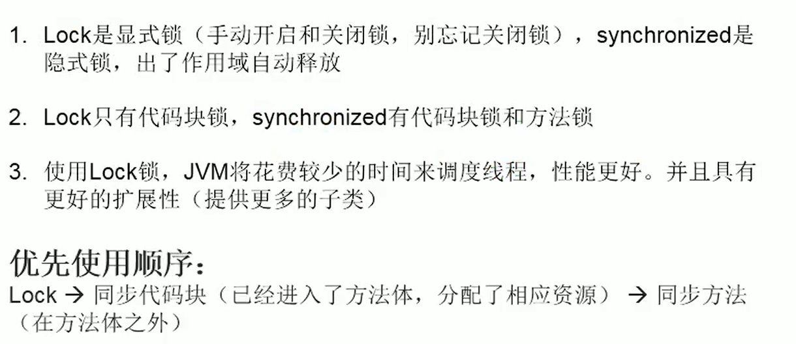

~~~java
package Senior.RRW.Thread;
/**
 *@description:  有两个储户分别向同一个账户取前，每次存1000，存3次，每次存完打印账户余额；
 *@author: RRW friend_rrw@163.com
 *@create: 2020-06-07 16:51
 */
class Account {
    private double balance;
    public Account(double balance) {
        this.balance = balance;
    }
    //存钱方法：
        public synchronized void deposit ( double money){
            if (money > 0) {
                balance += money;
                try { //在这加了sleep()，极大可能就会出现两个人都往里面存了钱，
                    //但一个人存钱成功之后会多了1000;那是因为这条线程睡了1s，
                    //后面的进来存了，它醒来才发现我就存1000，怎么多了1000？
                    Thread.sleep(1000);
                } catch (InterruptedException e) {
                    e.printStackTrace();
                }
                System.out.println(Thread.currentThread().getName()
                        +"存钱" + money + "成功！"+ "\t余额为" + balance);
            }
        }
    }
class Customer extends Thread{
    private Account accs;

    public Customer(Account accs) {
        this.accs = accs;
    }
    @Override
    public void run() {
        for (int i = 0; i < 3; i++) {
            accs.deposit(1000);
        }
    }
}
public class TestAccount {
    public static void main(String[] args) {
        Account accs = new Account(0);
        Customer c1 = new Customer(accs);
        Customer c2 = new Customer(accs);
        c1.setName("RRW");
        c2.setName("LQ");
        c1.start();
        c2.start();
    }
}
~~~

## 线程的通信：

~~~java
package Senior.RRW.Thread;

/**
 *@description:  线程的通信问题；
 *                使用两个线程交替打印1-100；
 *             注意：1.wait()/notify()/notifyAll()三个方法必须都是调用同一个监视器,
 *                  否则出现“java.lang.IllegalMonitorStateException”非法监视器状态异常；
 *
 *                  2.wait()/notify()/notifyAll()虽然在线程中出现，但是他们是
 *                  定义在Object类中的，而sleep()是定义在Thread类中的；言外之意，同步监视器
 *                  为任何一个类（只被调用一次）都可以充当，那么这个充当同步监视器的对象，则这个
 *                  对象方法wait()/notify()/notifyAll()，则应该在Object类中；
 *@author: RRW friend_rrw@163.com
 *@create: 2020-06-07 17:20
 */
class NUMber implements Runnable{
    private int number = 1;
    private Object obj = new Object();
    @Override
    public void run() {
        while (true){
            synchronized (obj) {
                obj.notify();//唤醒一个(优先级高的)线程，就可以实现线程121212交替打印了；
//                notifyAll();//全部唤醒
                if (number <= 100) {
                    try {
                        Thread.sleep(100);
                    } catch (InterruptedException e) {
                        e.printStackTrace();
                    }
                    System.out.println(Thread.currentThread().getName() + ":" + number);
                    number++;

                    try {
                        obj.wait(); //进入阻塞等待
                    } catch (InterruptedException e) {
                        e.printStackTrace();
                    }

                }else{
                    break;
                }
            }
        }
    }
}
public class ThreadCommunication {
    public static void main(String[] args) {
        NUMber n = new NUMber();
        Thread t1 = new Thread(n);
        Thread t2 = new Thread(n);
        t1.setName("线程1：");
        t2.setName("线程2：");
        t1.start();
        t2.start();
    }
}
~~~

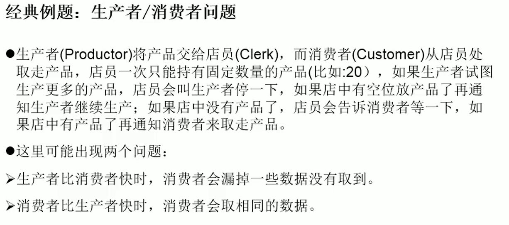

~~~java
package Senior.RRW.Thread;

/**
 *@description:
 *@author: RRW friend_rrw@163.com
 *@create: 2020-06-07 18:06
 */

class Shop{
    private int productNum = 0;
    public synchronized void shengchan() {
        if (productNum < 20){
            productNum++;
            System.out.println(Thread.currentThread().getName()+
                    "开始生产第："+ productNum+ "个产品");
            notify();//只要一生产就可以开始抢
        }else {
            //等待
            try {
                wait();
            } catch (InterruptedException e) {
                e.printStackTrace();
            }
        }
    }

    public synchronized void qianggou() {
        if (productNum > 0){
            System.out.println(Thread.currentThread().getName()+
                    "开始抢购第："+ productNum+ "个产品");
            productNum--;
            notify();
        }else {
            //等待
            try {
                wait();
            } catch (InterruptedException e) {
                e.printStackTrace();
            }
        }
    }
}
class Producer extends Thread{ //生产者
    private Shop shop;
    public Producer(Shop shop){
        this.shop = shop;
    }

    @Override
    public void run() {
        System.out.println(Thread.currentThread().getName()+":开始生产");
        while (true){
            try {
                Thread.sleep(100);//设置生产快些
            } catch (InterruptedException e) {
                e.printStackTrace();
            }
            shop.shengchan();
        }
    }
}
class Consumer extends Thread { //消费者
    private Shop shop;

    public Consumer(Shop shop) {
        this.shop = shop;
    }

    @Override
    public void run() {
        System.out.println(Thread.currentThread().getName() + ":开始抢");
        while (true) {
            try {
                Thread.sleep(1000);//设置抢慢一些；
            } catch (InterruptedException e) {
                e.printStackTrace();
            }
            shop.qianggou();
        }
    }
}
public class CandP_problem {
    public static void main(String[] args) {
        Shop shop = new Shop(); //作为同步监视器 唯一一个
        Producer p1 = new Producer(shop);
        p1.setName("生产者1：");
        //设生产者的优先级较高，避免消费者没有商品的前提下就开始抢；
        p1.setPriority(Thread.MAX_PRIORITY);
        Consumer c1 = new Consumer(shop);
        Consumer c2 = new Consumer(shop);
        Consumer c3 = new Consumer(shop);
        c1.setName("消费者1：");
        c2.setName("消费者2：");
        c3.setName("消费者3：");
        p1.start();
        c1.start();
        c2.start();
        c3.start();
    }
}
~~~

## JDK5.0后 新增的创建线程的方式：

+ ### 实现Callable接口：

  + #### 与使用Runnable相比，Callable功能更强大些

    + ##### 相比run（）方法，可以有返回值

    + ##### 方法可以抛出异常>支持泛型的返回值

    + ##### 需要借助FutureTask类，比如获取返回结果

      + 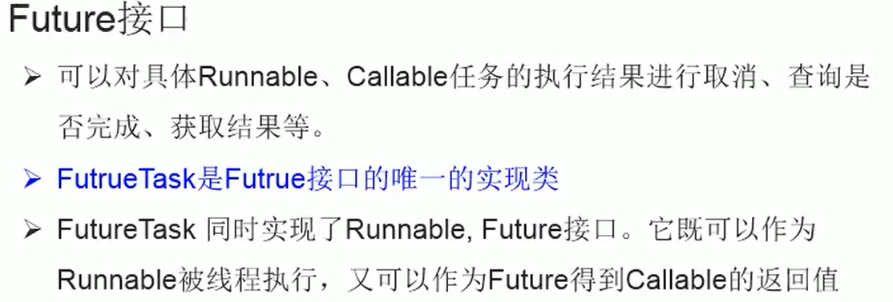

~~~java
package Senior.RRW.Thread;

import java.util.concurrent.Callable;
import java.util.concurrent.ExecutionException;
import java.util.concurrent.FutureTask;

/**
 *@description: 线程创建的方式三：实现Callable接口；
 *            为什么Callable要比Runnable好？
 *              1.call()有返回值；支线程执行完毕可以给其他线程返回结果；
 *              2.call()可以抛出异常，可以被外面的操作捕获异常信息；
 *              3.Callable支持泛型；
 *@author: RRW friend_rrw@163.com
 *@create: 2020-06-07 20:43
 */
//1、创建一个实现Callable的实现类：
class CallableThread implements Callable{
    //2、实现call()方法，将此线程需要执行的操作声明在call()中
    @Override
    public Object call() throws Exception {  //call():回调方法
        //这里涉及包装Integer，方法是Object类的返回，而下面return sum；是int型的,多态形式了；
        int sum = 0;
        for (int i = 0; i < 100; i++) {
            if (i % 3 == 0){
                System.out.println(i);
                sum += i;
            }
        }
        return sum;
    }
}

public class CallableTest {
    public static void main(String[] args) {
        //3、创建callable接口实现类的对象：
        CallableThread C1 = new CallableThread();
        //4、将此callable接口实现类的UI想走位传递到FutureTask构造器中，创建FutrueTask的对象；
        FutureTask futureTask = new FutureTask(C1);
        //创建线程：
        //5、将FutrueTask的对象作为参数传递到Thread类的构造器中，创建Thread类对象，调用start();
        new Thread(futureTask).start();//FutureTask也实现了Runnable
        //源码：public class FutureTask<V> implements RunnableFuture<V> {
        try {
            //6、获取Callable总call()方法的返回值
            //get()方法返回值是FutureTask构造器参数Callable实现类重写call()的返回值 即sum
            Object sum = futureTask.get();
            System.out.println("我是call()的返回，总和："+ sum);
        } catch (InterruptedException e) {
            e.printStackTrace();
        } catch (ExecutionException e) {
            e.printStackTrace();
        }
    }
}
~~~

+ ## 使用线程池：

  + ##### 背景：经常创建和销毁、使用量特别大的资源，比如并发情况下的线程，对性能影响很大。而且当工程大的时候，线程不是说你需要我才给造吧，不符合实际；

  + ##### 思路：提前创建好多个线程，放入线程池中，使用时直接获取，使用完放回池中。可以避免频繁创建销毁、实现重复利用。类似生活中的公共交通工具。

  + ##### 好处：提高响应速度（减少了创建新线程的时间）

    + 降低资源消耗（重复利用线程池中线程，不需要每次都创建）

    + 便于线程管理

      ###### √ corePoolSize：核心池的大小

      ###### √ maximumPoolSize：最大线程数

      ###### √ keepAliveTime：线程没有任务时最多保持多长时间后会终止 ...

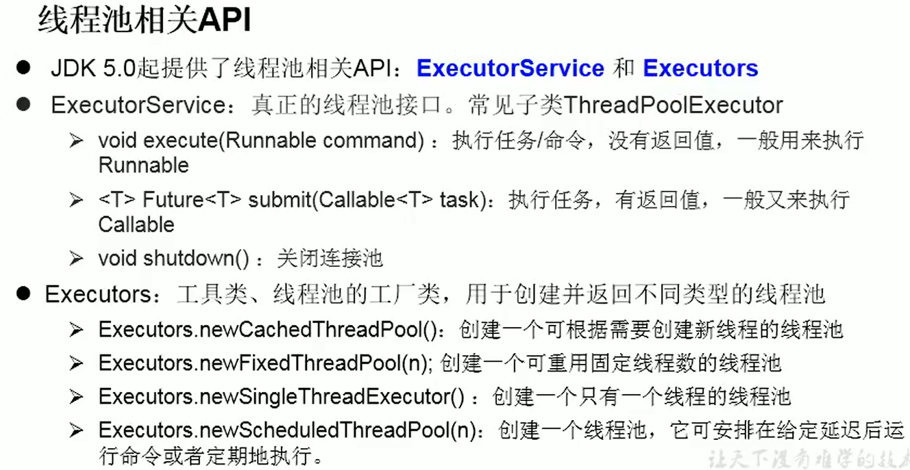

~~~java
package Senior.RRW.Thread;

import java.util.concurrent.ExecutorService;
import java.util.concurrent.Executors;
import java.util.concurrent.ThreadPoolExecutor;

/**
 *@description: 创建线程的方式四： 使用线程池；
 *@author: RRW friend_rrw@163.com
 *@create: 2020-06-07 21:50
 */

class Dowork implements Runnable{
private int sum = 0;
    @Override
    public void run() {
        for (int i = 0; i <= 100; i++) {
            if (i % 2 == 0){
                System.out.println(Thread.currentThread().getName()+
                        ":"+i);
                sum += i;
            }
        }
        System.out.println("总和："+sum);
    }
}

public class ThreadPool {
    public static void main(String[] args) {
/*        //1.创建一个可重用固定线程数的线程池：
        ExecutorService executorService = Executors.newFixedThreadPool(10);
        //提供实现Runnable/Callable接口实现类的对象，告诉线程池要干嘛；
        executorService.execute(new Dowork());//适用于Runnable
        //executorService.submit(Callable callable);//使用于Callable
        executorService.shutdown(); //关闭线程池；
*/

        //那上面提到的线程管理怎么体现呢？
        //首先就要设置线程池的属性： 那属性怎么获取？
        //发现用池executorService.不出这些属性；而ExecutorService是一个接口，没有对象
        //则可以使用getClass（）获取接口ExecutorService实现某个类的对象；
        ExecutorService executorService = Executors.newFixedThreadPool(10);
        System.out.println(executorService.getClass());//class java.util.concurrent.ThreadPoolExecutor
        /*实际上ThreadPoolExecutor这个类有：
              ThreadPoolExecutor extends AbstractExecutorService;
              AbstractExecutorService implements ExecutorService;
              如上的对应关系；考虑强转一下：
              */
        ThreadPoolExecutor executorService1 = (ThreadPoolExecutor) executorService;
        //此时executorService1.是 ThreadPoolExecutor 返回的对象，就可以看到它的属性了
        executorService1.setCorePoolSize(10);//线程核心数
        //executorService1.setMaximumPoolSize(20);//最大线程数
        //executorService1.setKeepAliveTime();//无任务等待时长后终止
        executorService1.execute(new Dowork());
        executorService1.shutdown();
    }
}
~~~

